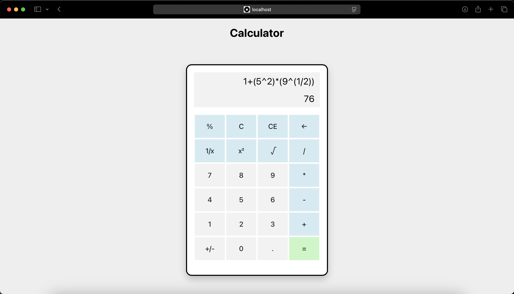
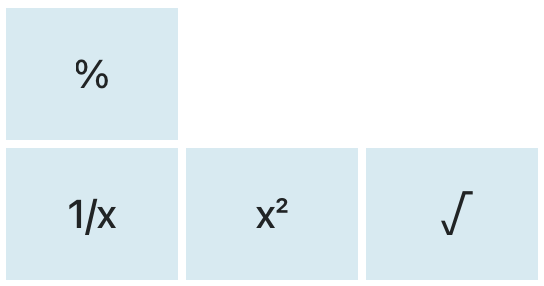
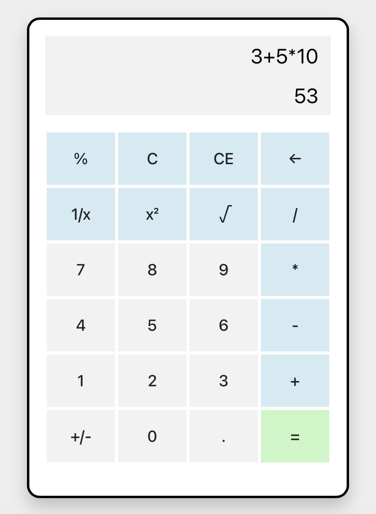
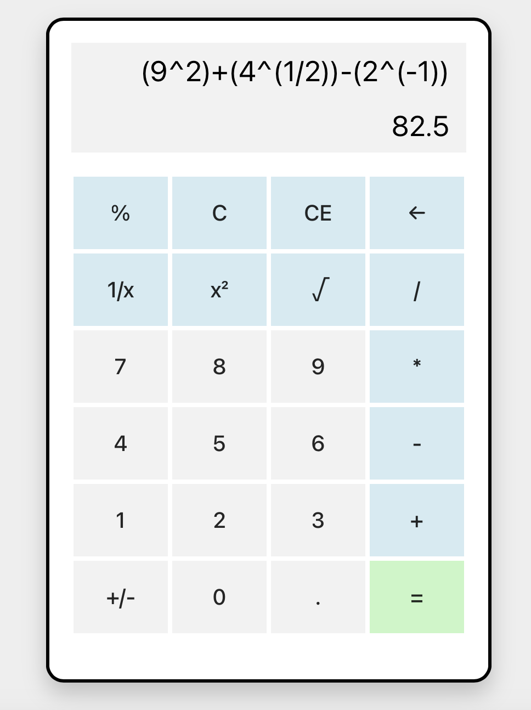
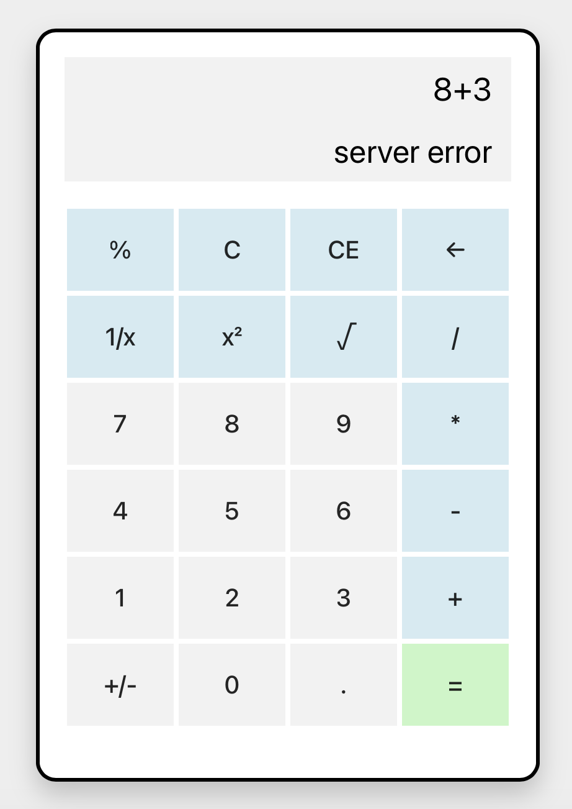
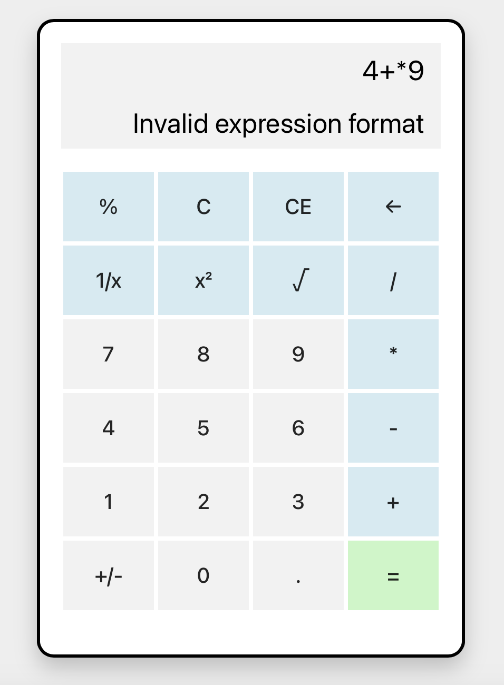
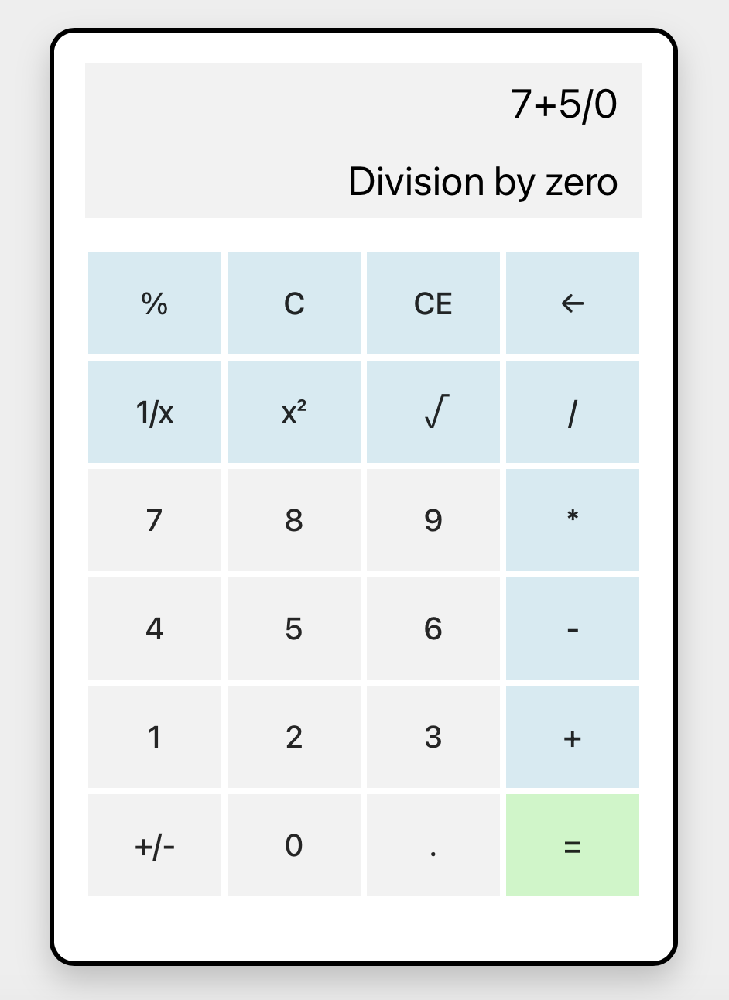
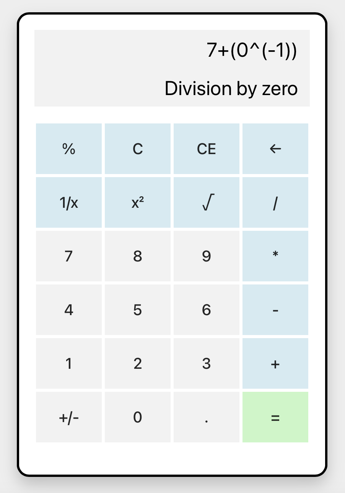

# Calculator Web Application

## OverView

This is a web-based calculator application built with a **React** frontend and a **Spring Boot** backend. The app provides users with a simple interface to perform basic arithmetic operations. The frontend handles the user interface, while the backend processes calculations and manages requests.



## Table of Contents

- [Features](#features)
- [Tech Stack](#tech-stack)
- [Clone Repository](#clone-repository)
- [Getting Started](#getting-started)
- [Frontend](#frontend)
- [Backend](#backend)
- [Usage](#usage)
- [Troubleshooting](#troubleshooting)
- [Assumptions](#assumptions)
- [Test Cases](#test-cases)

## Features

- Basic arithmetic operations: addition, subtraction, multiplication, and division.
- Clean and responsive user interface.
- Organized backend logic for calculation processing.
- Error handling for invalid inputs, such as division by zero and entering wrong expressions.

## Tech Stack

### Frontend

- **React**: JavaScript library for building user interfaces.
- **CSS**: Styling the calculator layout and components.
- **Axios**: For making HTTP requests to the backend.

### Backend

- **Spring Boot**: Java framework for building RESTful services.
- **Java**: Programming language for backend logic.
- **exp4j**: Library used to evaluate mathematical expressions.

## Clone Repository

1. **Open a terminal** on your local machine.
2. Navigate to the directory where you want to clone the project.
3. Run the following command:
   ```bash
   git clone https://github.com/omarzydan610/Calculator_React-SpringBoot.git
   ```
4. Move into the project directory:
   ```bash
   cd Calculator_React-SpringBoot
   ```

## Getting Started

### Prerequisites

- **Node.js** and **npm** (for running the frontend).
- **Java 8+** (for running the Spring Boot backend).
- **Maven** (for dependency management in the backend).

### Installation

1. Install dependencies for the frontend:

   ```bash
   cd frontend
   npm install
   ```
2. Install dependencies for the backend:

   ```bash
   cd ../backend
   mvn install
   ```

## Frontend

### Starting the Frontend

Navigate to the `frontend` directory and run:

```bash
npm start
```

This will start the React development server, usually on `http://localhost:3000`.

### Frontend Structure

- `App.js`: Root component, manages calculator state and event handling.
- `CalculatorButton.js`: Button component, handling individual button interactions.
- `CalculatorDisplay.js`: Display component, showing calculation results.

## Backend

### Starting the Backend

Navigate to the `backend` directory and run:

```bash
mvn spring-boot:run
```

The Spring Boot server will start, typically on `http://localhost:8080`.

### Backend Structure

- `CalculatorController.java`: Handles HTTP requests and routes them to the service layer.
- `CalculatorService.java`: Core logic for arithmetic operations.
- `Application.java`: Main entry point for starting the Spring Boot application.

## Usage

1. Start the backend server.
2. Start the frontend server.
3. Open a browser and navigate to `http://localhost:3000` to use the calculator app.

### How to Use the Calculator

- **Input Numbers**: Click on the number buttons to enter digits.
- **Select Operation**: Choose an arithmetic operation (addition, subtraction, multiplication, division) by clicking the corresponding button.
- **Calculate Result**: After entering the numbers and selecting the operation, click the `=` button to calculate the result.
- **Clear Input**: Use the `C` button to clear the current input and start a new calculation.
- **Error Handling**: If an invalid operation is attempted (like dividing by zero or entering an incorrect expression), an error message will be displayed.

## Troubleshooting

- **Backend Server Won't Start**: Ensure you have Java 8 or higher installed and that the `JAVA_HOME` environment variable is set correctly.
- **Frontend Not Loading**: Check if the backend server is running, as the frontend relies on it to fetch data.
- **Errors on Calculation**: Make sure to enter valid expressions. Avoid dividing by zero or using invalid operators.
- **Network Errors**: If you encounter Axios errors, check your network connection and ensure that the backend is running on the expected port (`8080`).

## Assumptions

#### For these buttons You should enter the number before



## Test Cases


|         |         |
| -------------------------------------------------------- | -------------------------------------------------------- |
| <br />  |      |
|         |         |
